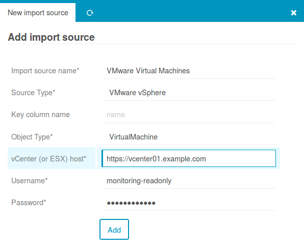

vSphere - Icinga Web 2 module
=============================

At the time of this writing, this module is mainly an Import Source provider for
the [Icinga Director](https://github.com/Icinga/icingaweb2-module-director).

In case you want to have an automated import of your Virtual Machines from **VMware
Sphere** (vCenter) into your Icinga monitoring system this module might be what you
have been looking for.

Documentation
-------------

### Basics
* [Installation](doc/01-Installation.md)
* [Define an Import Source](doc/03-Import-Source.md)
* [Working on the CLI](doc/04-CLI-Commands.md)
