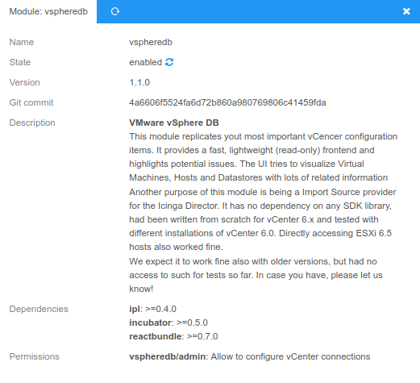

<a id="Installation"></a>Installation
=====================================

Requirements
------------

* Icinga Web 2 (&gt;= 2.5)
* PHP (&gt;= 5.6, preferably 7.x)
* php-soap
* php-pcntl (might already be built into your PHP binary)
* php-posix (on RHEL/CentOS this is php-process, or rh-php7x-php-process)
* MySQL (&gt;= 5.6) or MariaDB (&gt;= 5.5.3)
* Icinga Web 2 modules:
  * [reactbundle](https://github.com/Icinga/icingaweb2-module-reactbundle) (>= 0.4) (Icinga Web 2 module)
  * [Icinga PHP Library (ipl)](https://github.com/Icinga/icingaweb2-module-ipl) (>= 0.2) (Icinga Web 2 module)
  * [incubator](https://github.com/Icinga/icingaweb2-module-incubator) (>= 0.2) (Icinga Web 2 module)
  * Suggested: [Icinga Director](https://github.com/Icinga/icingaweb2-module-director) (&gt;= v1.7)

Once you got Icinga Web 2 up and running, all required dependencies should
already be there. All, but `php-soap` and `php-posix`. They are available on
all major Linux distributions and can be installed with your package manager
(yum, apt...). Same goes also for non-Linux systems. Please do not forget to
restart your web server service afterwards.

Installation from .tar.gz
-------------------------

Download the latest version and extract it to a folder named
`vspheredb` in one of your Icinga Web 2 module path directories.

You might want to use a script as follows for this task:
```sh
ICINGAWEB_MODULEPATH="/usr/share/icingaweb2/modules"
REPO_URL="https://github.com/Icinga/icingaweb2-module-vspheredb"
TARGET_DIR="${ICINGAWEB_MODULEPATH}/vspheredb"
MODULE_VERSION="1.0.3"
URL="${REPO_URL}/archive/v${MODULE_VERSION}.tar.gz"
install -d -m 0755 "${TARGET_DIR}"
wget -q -O - "$URL" | tar xfz - -C "${TARGET_DIR}" --strip-components 1
```

Installation from GIT repository
--------------------------------

Another convenient method is the installation directly from our GIT repository.
Just clone the repository to one of your Icinga Web 2 module path directories.
It will be immediately ready for use:

```sh
ICINGAWEB_MODULEPATH="/usr/share/icingaweb2/modules"
REPO_URL="https://github.com/Icinga/icingaweb2-module-vspheredb"
TARGET_DIR="${ICINGAWEB_MODULEPATH}/vspheredb"
git clone "${REPO_URL}" "${TARGET_DIR}"
```

You can now directly use our current GIT master or check out a specific version.

Database
--------

### Create an empty database on MariaDB (or MySQL)

HINT: You should replace `some-password` with a secure custom password.

    mysql -e "CREATE DATABASE vspheredb CHARACTER SET 'utf8mb4' COLLATE utf8mb4_bin;
       GRANT ALL ON vspheredb.* TO vspheredb@localhost IDENTIFIED BY 'some-password';"

### Create a related Icinga Web 2 Database resource

In your web frontend please go to `Configuration / Application / Resources`
and create a new database resource pointing to your newly created database.
Please make sure that you choose `utf8mb4` as an encoding.

Alternatively, you could also manally add a resource definition to your
resources.ini:

#### /etc/icingaweb2/resources.ini

```ini
[vSphereDB]
type = "db"
db = "mysql"
host = "localhost"
; port = 3306
dbname = "vspheredb"
username = "vspheredb"
password = "***"
charset = "utf8mb4"
```

Tell vSphereDB about it's database
----------------------------------

In the module's config.ini (usually `/etc/icingaweb2/modules/vspheredb/config.ini`)
you need to reference above DB connection:

```ini
[db]
resource = "vSphereDB"
```

Enable the newly installed module
---------------------------------

Enable the `vspheredb` module either on the CLI by running...

```sh
icingacli module enable vspheredb
```

...or go to your Icinga Web 2 frontend, choose `Configuration` -&gt; `Modules`
-&gt; `vspheredb` module - and `enable` it:



Now please:
* Eventually SHIFT-Reload your browser window to get a fresh CSS/JS bundle
* Got to `Virtualization (VMware)` choose your DB resource and create the schema
* Enable the background daemon (see below)

Enabling and running the background daemon
------------------------------------------

The preferred method of running the Background Daemon is via SystemD. We ship
a sample Unit File, so if you have an `icingaweb2` User on your system all you
need to do is:

    cp contrib/systemd/icinga-vspheredb.service  /etc/systemd/system/
    systemctl daemon-reload
    systemctl enable icinga-vspheredb
    systemctl start icinga-vspheredb

Otherwise please use a member of the `icingaweb2` group like `apache` or
`www-data`. You might also want to create a new dedicated User with read
permissions for `/etc/icingaweb2`.

That's it, your daemon should now be running. Feel free to configure as many
vCenter Servers as you want.

### Without SystemD

When not running SystemD you're on your own, the command you're looking for is:

    /usr/bin/icingacli vspheredb daemon run
