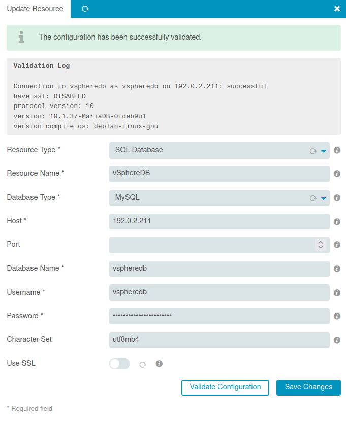
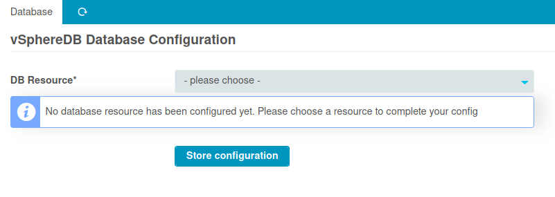
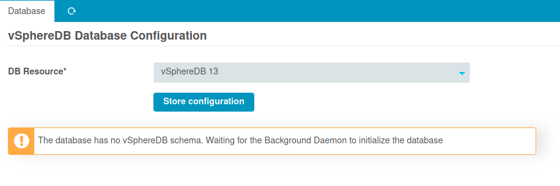

<a id="Installation"></a>Installation
=====================================

Requirements
------------

* Icinga Web 2 (&gt;= 2.8)
* PHP (&gt;= 7.1 or 8.x - 64bit only)
* php-soap
* php-pcntl (might already be built into your PHP binary)
* php-posix (on RHEL/CentOS this is php-process, or rh-php7x-php-process)
* MySQL (&gt;= 5.7) or MariaDB (&gt;= 10.3)
* The following Icinga modules must be installed and enabled:
  * [incubator](https://github.com/Icinga/icingaweb2-module-incubator) (>=0.15)
  * If you are using Icinga Web &lt; 2.9.0, the following modules are also required
    * [ipl](https://github.com/Icinga/icingaweb2-module-ipl) (>=0.5.0)
    * [reactbundle](https://github.com/Icinga/icingaweb2-module-reactbundle) (>=0.8.0)

Once you got Icinga Web 2 up and running, all required dependencies should
already be there. All, but `php-soap` and `php-posix`. They are available on
all major Linux distributions and can be installed with your package manager
(yum, apt...). Same also goes true for non-Linux systems.

Preparation - Database
----------------------

### Create an empty database on MariaDB (or MySQL)

The vSphereDB module requires a MariaDB or MySQL database:

    mysql -e "CREATE DATABASE vspheredb CHARACTER SET 'utf8mb4' COLLATE utf8mb4_bin;
       CREATE USER vspheredb@localhost IDENTIFIED BY 'some-password';
       GRANT ALL ON vspheredb.* TO vspheredb@localhost;"

HINT: You should replace `some-password` with a secure custom password.

In your web frontend please go to `Configuration / Application / Resources`
and create a new database resource pointing to your newly created database.
Please make sure that you choose `utf8mb4` as an encoding.




Installation
------------

### Module installation (or upgrade)

This script downloads the [latest version](https://github.com/Icinga/icingaweb2-module-vspheredb/releases)
and extract installs it to the default Icinga Web 2 module directory. An eventually
existing module installation will be replaced, so this can be used for upgrades too:

```shell
# You can customize these settings, but we suggest to stick with our defaults:
MODULE_VERSION="1.3.1"
DAEMON_USER="icingavspheredb"
DAEMON_GROUP="icingaweb2"
ICINGAWEB_MODULEPATH="/usr/share/icingaweb2/modules"
REPO_URL="https://github.com/icinga/icingaweb2-module-vspheredb"
TARGET_DIR="${ICINGAWEB_MODULEPATH}/vspheredb"
URL="${REPO_URL}/archive/refs/tags/v${MODULE_VERSION}.tar.gz"

# systemd defaults:
SOCKET_PATH=/run/icinga-vspheredb
TMPFILES_CONFIG=/etc/tmpfiles.d/icinga-vspheredb.conf

getent passwd "${DAEMON_USER}" > /dev/null || useradd -r -g "${DAEMON_GROUP}" \
  -d /var/lib/${DAEMON_USER} -s /bin/false ${DAEMON_USER}
install -d -o "${DAEMON_USER}" -g "${DAEMON_GROUP}" -m 0750 /var/lib/${DAEMON_USER}
install -d -m 0755 "${TARGET_DIR}"

test -d "${TARGET_DIR}_TMP" && rm -rf "${TARGET_DIR}_TMP"
test -d "${TARGET_DIR}_BACKUP" && rm -rf "${TARGET_DIR}_BACKUP"
install -d -o root -g root -m 0755 "${TARGET_DIR}_TMP"
wget -q -O - "$URL" | tar xfz - -C "${TARGET_DIR}_TMP" --strip-components 1 \
  && mv "${TARGET_DIR}" "${TARGET_DIR}_BACKUP" \
  && mv "${TARGET_DIR}_TMP" "${TARGET_DIR}" \
  && rm -rf "${TARGET_DIR}_BACKUP"

echo "d ${SOCKET_PATH} 0755 ${DAEMON_USER} ${DAEMON_GROUP} -" > "${TMPFILES_CONFIG}"
cp -f "${TARGET_DIR}/contrib/systemd/icinga-vspheredb.service" /etc/systemd/system/
systemd-tmpfiles --create "${TMPFILES_CONFIG}"

icingacli module enable vspheredb
systemctl daemon-reload
systemctl enable icinga-vspheredb.service
systemctl restart icinga-vspheredb.service
```

You're ready to go
------------------

### Choose your Icinga Web 2 Database resource

Now you can head on to **Virtualization (vmWare)** in your menu. vSphereDB will
ask you to choose a specific DB resource:



Finally, you only need to wait for the Background Daemon to prepare the database
for you:



That's it!

FAQ
---

### Running without SystemD

systemd is not a hard requirement, you can use any supervisor you want. The
command you're looking for is:

    /usr/bin/icingacli vspheredb daemon run

### High availability

Using an active-active replication is the preferred way when running vSphereDB.
Please do **not** run multiple daemons writing into the same database, make sure
to have only one vSphereDB daemon instance running at the same time. Configure a
floating IP for your database connection.
