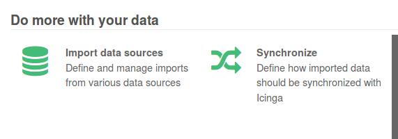
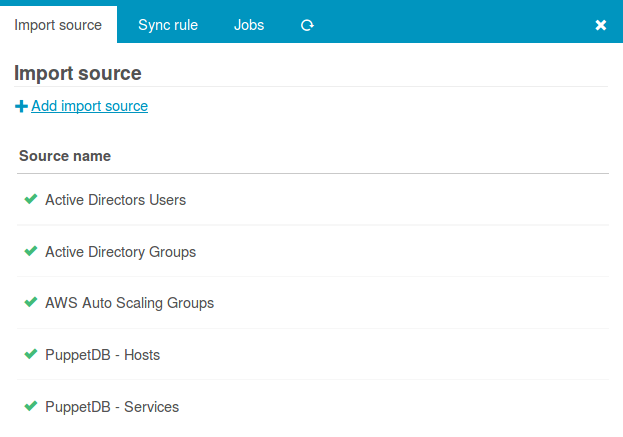
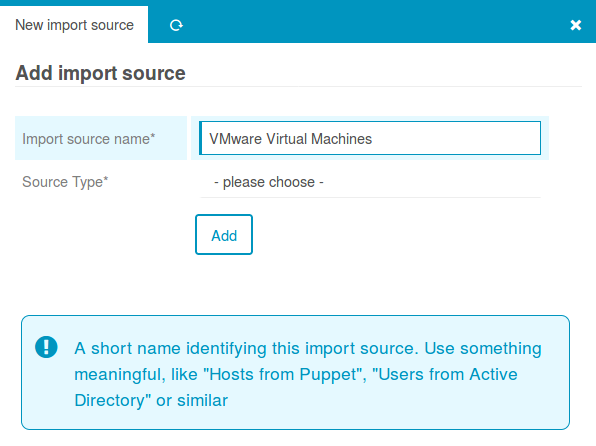
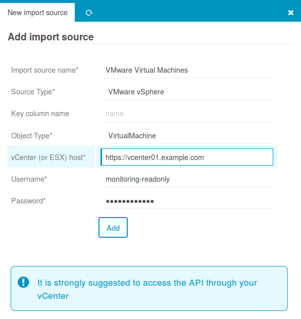
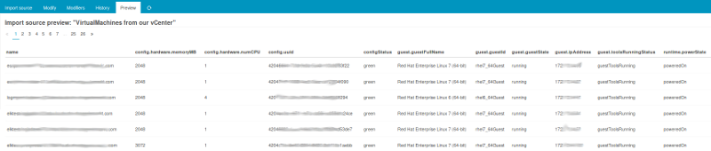

Director Import Source configuration
================================================================

To create a new **VMware vSphere** Import Source for the [Icinga Director](
https://github.com/Icinga/icingaweb2-module-director) please go to the Director
Dashboard and choose *Import data sources*:

This brings you to your list of configured **Import Source** definitions, we want to
**Add** a new one:

Naming is usually the hardest task. Please take some time to choose a good name
for your new Import Source. The name should tell me what to expect from this
Import Source, even when being completely new to your environment:

Even more important, please choose your **Source Type**. As you managed it to
find this documentation I guess the VMware vSphere import is what you are looking
for:

As soon as you've chosen the correct Source Type, it will ask you for more
details. Please try to avoid creating connections to every single ESX host
and fetch your data from your vCenter:

That's it, once you confirmed that you want to **Add** this new **Import Source**
you are all done. A click on the **Preview** tab should now already show some data:

This proves that everything works fine. Now as usual, please define a **Sync Rule**
for this Import source, as explained in the related Icinga Director [documentation](
https://github.com/Icinga/icingaweb2-module-director/blob/master/doc/70-Import-and-Sync.md).
