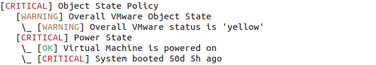

Check Commands
=========================================

This module collects a lot of data from your vCenter(s) and/or ESXi Host(s).
Having single Check commands with lots of parameters and thresholds wouldn't
be very efficient, that's why we opted for shared responsibility:

* **Check Commands** are available as the glue between this module and the Icinga
  Core
* **Monitoring Rule Definitions** can be configured in the UI, and have a direct
  influence on related Check Commands

Object Checks based on Monitoring Rules
---------------------------------------

Thresholds and parameters for the following Checks can be defined in a hierarchical
way. Please read our [Monitoring Rules documentation](32-Monitoring_Rules.md) for
related details.

### Check Host Health

    icingacli vspheredb check host --name <name> [--ruleset <set>[ --rule <rule]]

Checks the given Host, according the configured rules, with the Host matching the
given name.

### Check Virtual Machine Health

    icingacli vspheredb check vm --name <name> [--ruleset <set>[ --rule <rule]]

Checks the Virtual Machine with the given name. If none is found, the check tries
to load a VM with such a guest hostname.

### Check Datastore Health

    icingacli vspheredb check datastore --name <name> [--ruleset <set>[ --rule <rule]]

Checks the given Datastore object.

### Monitoring Rule Check Inspection

All above commands support the `--inspect` parameter. If supplied, the output changes
from this...

    icingacli vspheredb check vm --name vm.example.com

...to this:

    icingacli vspheredb check vm --name vm.example.com --inspect

You can see, which settings and thresholds have been in effect for this check. In
case they have been overridden somewhere in the path hierarchy, this is also being
shown.

Inspection also shows Rule Set and Rule names, together with the parameter name you
can use to check only the related subset of this check. Please read the next chapter
for related details.

### Checking a specific Rule or Rule Set

In the former chapter we learned how to figure out which monitoring Rule Sets and
Rule definitions are provided by vSphereDB. Let's pick the `ObjectStatePolicy` Set
and give it a try:

    icingacli vspheredb check vm --name vm.example.com --ruleset ObjectStatePolicy

Looks good to me, let's add `--inspect` to re-check where our settings came from:

    icingacli vspheredb check vm --name vm.example.com --ruleset ObjectStatePolicy --inspect

Ok, all settings are defaults, just `trigger_on_gray` has been overridden for the
`SYSTEM INTEGRATION` folder and it's sub-folders.

Let's pick a specific rule:

    icingacli vspheredb check vm --name vm.example.com --rule PowerState

It complains, as it isn't possible to specify a Rule without the related Set. That's
reasonable, we'll add the Rule Set to our Check Command:

    icingacli vspheredb check vm --name vm.example.com \
        --ruleset ObjectStatePolicy --rule PowerState

Looks much better now. Of course, the `--inspect` parameter is supported here too:

    icingacli vspheredb check vm --name vm.example.com \
        --ruleset ObjectStatePolicy --rule PowerState --inspect

Object Type Summary Checks
--------------------------

These Checks allow to query the overall VMware object state for all instances
of a specific object at once. This might not be very useful in larger environments,
but might help to get a quick overview in smaller ones.

### Check all Hosts

    icingacli vspheredb check hosts

### Check all Virtual Machines

    icingacli vspheredb check vms

### Check all Datastores

    icingacli vspheredb check datastores

Self-Monitoring Health Check
----------------------------

There is a generic health check, which talks to the vSphereDB daemon through
it's Unix socket, reports generic health information, complains in case the
daemon is not reachable or when one of the vCenters/ESXi host connections is
failing or in a dubios state:

    icingacli vspheredb check health

The following image shows a sample output:

Formatting slightly differs based on whether you're monitoring multiple
vCenters/ESXi hosts, or just a single one. In case the daemon is not running,
this will also be reported:

This check also complains if your daemon is not able to refresh the database:

Checking for a single vCenter/ESXi Host connection
--------------------------------------------------

In case you want to check whether the vCenter has a connection to a very specific
vCenter, you can do so via:

    icingacli vspheredb check vcenterconnection --vCenter <id>

