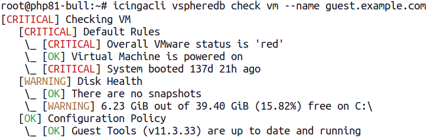
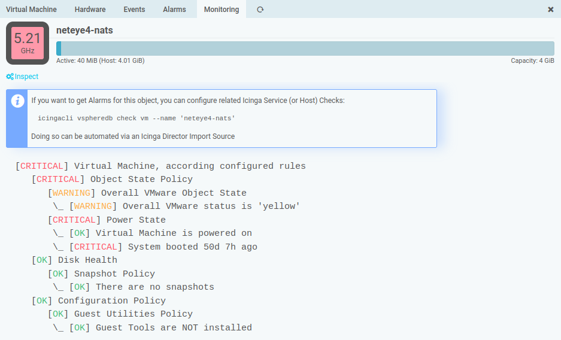

Overview
===================================

This module collects a lot of data from your vCenter(s) and/or ESXi Host(s).
Having single Check commands with lots of parameters and thresholds wouldn't
be very efficient, that's why we opted for shared responsibility:

* **Check Commands** are available as the glue between this module and the Icinga
  Core
* **Monitoring Rule Definitions** can be configured in the UI, and have a direct
  influence on related Check Commands

Self-Monitoring Health Check
----------------------------

There is a generic health check, which talks to the vSphereDB daemon through
it's Unix socket, reports generic health information, complains in case the
daemon is not reachable or when one of the vCenters/ESXi host connections is
failing or in a dubios state:

    icingacli vspheredb check health

The following image shows a sample output:

Formatting slightly differs based on whether you're monitoring multiple
vCenters/ESXi hosts, or just a single one. In case the daemon is not running,
this will also be reported:

In case you want to check whether the vCenter has a connection to a very specific
vCenter, you can do so via:

    icingacli vspheredb check vcenterconnection --vCenter <id>

Monitoring Rule Definitions
---------------------------

Our simple Check Commands have been available since a long time, but since v1.4
they learned many new tricks, and their behavior can be tweaked directly in the
Web frontend. Via **Monitoring Rules** you can reach the related overview page:

Please navigate to **Hosts**, **Virtual Machines** or **Data Stores** for a related
tree representation:

This depends on whether and how you organized your vSphere Objects in folders.
At every level in this hierarchy, you can configure, override and also disable
related Checks:

Some Rules allow for multiple instances, currently Disk Checks are the only such
implementation:

You can add as many variants as you want at every node, and you can still extend,
override or even disable them for a specific subtree.

All changes, once stored, have immediate effect on related Check Commands:

Virtual Machines are the object type with the most available Rule Types for now.
They offer a related **Monitoring** tab to show what the Check Command would
tell you:

You can show applied settings in case you need to investigate a specific Check:

Check Commands
--------------

### Check Host Health

    icingacli vspheredb check host [--name <name>]

Checks the given Host, according the configured rules, with the Host matching the
given name.

### Check Virtual Machine Health

    icingacli vspheredb check vm [--name <name>]

Checks the Virtual Machine with the given name. If none is found, the check tries
to load a VM with such a guest hostname.

### Check Datastore Health

    icingacli vspheredb check datastore [--name <name>]

Checks the given Datastore object.

Object Type Summary Checks
--------------------------

These Checks allow to query the overall VMware object state for all instances
of a specific object at once. This might not be very useful in larger environments,
but might help to get a quick overview in smaller ones.

### Check all Hosts

    icingacli vspheredb check hosts

### Check all Virtual Machines

    icingacli vspheredb check vms

### Check all Datastores

    icingacli vspheredb check datastores
