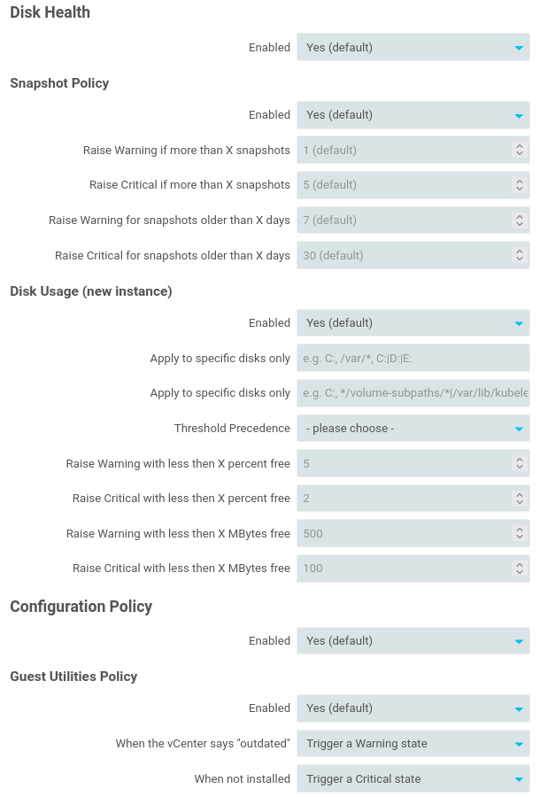
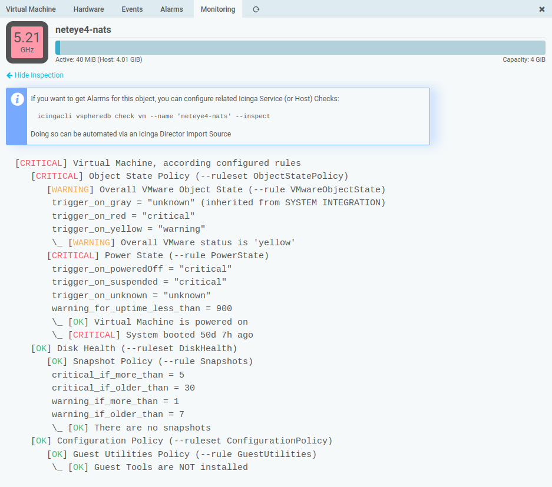

Monitoring Rules
=============================================

Our simple Check Commands have been available since a long time, but since v1.4
they learned many new tricks, and their behavior can be tweaked directly in the
Web frontend. Via **Monitoring Rules** you can reach the related overview page:

Please navigate to **Hosts**, **Virtual Machines** or **Data Stores** for a related
tree representation:

This depends on whether and how you organized your vSphere Objects in folders.
At every level in this hierarchy, you can configure, override and also disable
related Checks:

Some Rules allow for multiple instances, currently Disk Checks are the only such
implementation:

You can add as many variants as you want at every node, and you can still extend,
override or even disable them for a specific subtree.

All changes, once stored, have immediate effect on related Check Commands:

Virtual Machines are the object type with the most available Rule Types for now.
They offer a related **Monitoring** tab to show what the Check Command would
tell you:

You can show applied settings in case you need to investigate a specific Check:

If you want to execute the related Check Plugin, please read more about our
[Check Commands](31-Check_Commands.md).
