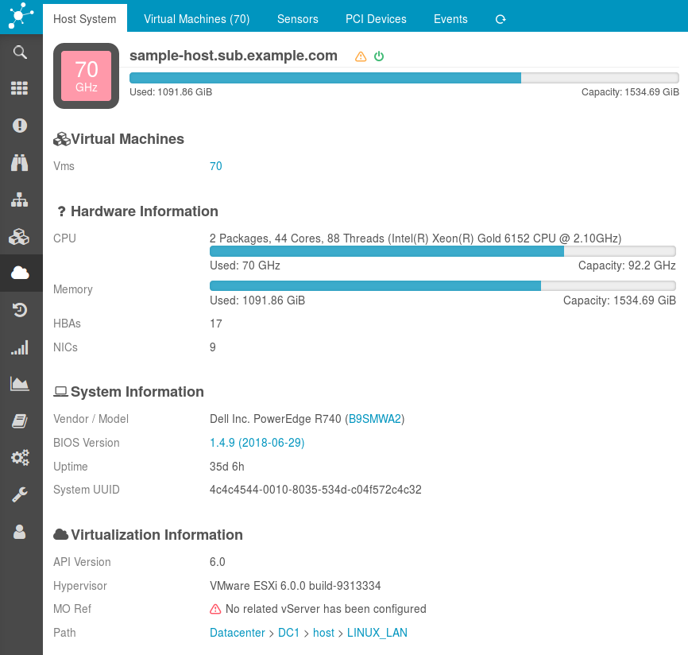
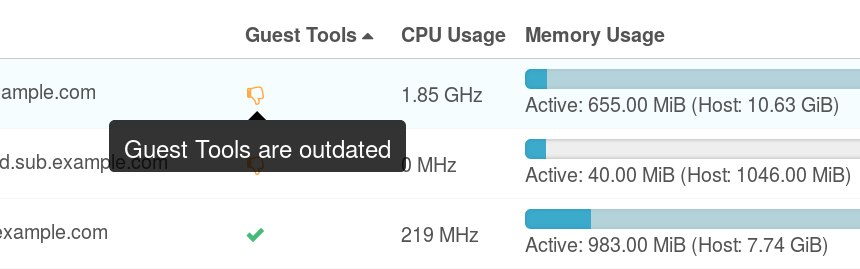
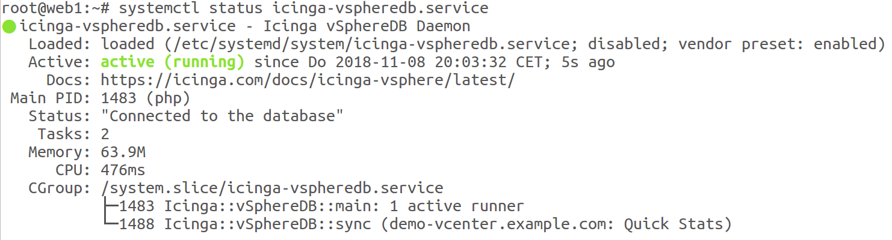
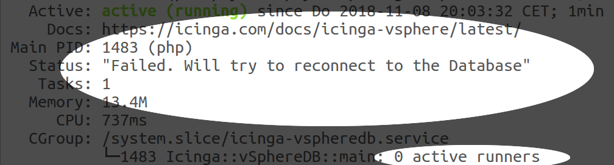

Changelog
===============================

next (will be 1.2.0)
--------------------

### Breaking Changes
* Dependencies have been raised, our [Installation](01-Installation.md)
  documentations contain related details

### Upgrading
This release brings Schema migrations, which can be applied with a single click
in the Frontend. Please **Apply** the pending schema migration. Afterwards please
restart the *Background Daemon*.

### UI
* FIX: hide column for an experimental feature (#153)
* FIX: avoid PHP warnings on 7.4 when showing Host details/special cols (#169)
* FIX: deleting Server connections has been fixed (#155)
* FIX: Server Form presents masked dummy value, not masked password
* FIX: sorting hosts by state summary
* FIX: do not fail when showing VMs with missing linked hosts (#204)
* FEATURE: show Virtual Machine Custom Values (#88)
* FEATURE: Hosts Table now provides ESXi version column
* FEATURE: show Host NIC information (#177)
* FEATURE: a console link (via VMRC) is now available (#141)
* FEATURE: reorganized VM detail sections (#182)
* FEATURE: propose DB migrations in a more prominent place (#20)
* FEATURE: detail view has been optimized for wider screens (#186)
* FEATURE: installed VMware tools version is now available (#71)
* FEATURE: overview tree no longer skips some levels (#181)
* FEATURE: support 'compact' mode for dashboard use (#134)
* FEATURE: vCenter summary now shows Storage totals (#191)
* FEATURE: optional VMware software column for the vCenter overview (#192)
* FEATURE: Veeam backup tool info now also works with Custom Values (#193)
* FEATURE: VM location details now provide a link to the vCenter (#148)
* FEATURE: HTML5 UI link has been introduced (#194)
* FEATURE: vCenter links point to new vCenter summary/detail page (#195)
* FEATURE: improve sensor table styling (#196)
* FEATURE: restructure/style Host Detail view (#199)
* FEATURE: VM details now show host resource usage (#120)
* FEATURE: Provide suggestions in case there is no vCenter (#189)
* FEATURE: allow to define a custom vCenter display name (#121)
* FEATURE: show VM templates as such to make them distinguishable (#205)
* FEATURE: add vCenter-related object summaries (#237)

### CLI
* FIX: vm check now also looks for object name (#109)
* FIX: strip non-UTF8-characters from error messages (#124)
* FIX: check command should show critical problems first (#126)

### Background Daemon
* FIX: do not allow ENV proxy settings to override server config (#159)
* FIX: sync no longer fails on objects with no overallState (#98)
* FIX: sub-tasks will now terminate early on DB errors (#151)
* FIX: correct log-level is now passed to child-processes (#138)
* FIX: there was one more issue with zero-sized DataStores (#149)
* FIX: Host PCI devices fixed for Mysql 8.x (#86)
* FIX: do not fail when there are Opaque Networks (#166)
* FIX: eventual DB errors in moref task are now re-thrown (#167)
* FEATURE: synchronize Custom Values (#88)
* FEATURE: synchronize VirtualMachines belonging to vApps (#31)
* FEATURE: synchronize many Host Network related objects (#177)
* FEATURE: log VMs with no parent to learn more about them (#202)

### Integrations
* FEATURE: ship more VM properties with our Director Import Source
* FEATURE: ship Custom Values for the Icinga Director (#88)
* FEATURE: Import Source now ships Compute Resources (#185) and Datastores (#246)

### DB Schema
* FIX: dropped a unique constraint on BIOS UUID because of VMware bugs (#83, #99)
* FIX: large-grown daemon log table has been truncated (#138)
* FIX: allow event/alert messages longer than 64kB (#133)
* FIX: allow unusually large guestFullName values (#146)
* FIX: allow most VM values to be NULL, VMs which never started (#197, others)
* FIX: allow longer moref ids for Opaque Network and DVPGs (#166)
* FEATURE: compute_cluster is now a dedicated table and object (#187)
* FEATURE: introduce host_system DAS/HA-state (#200)

### vSphere API
* FIX: login to vSphere 7.0 failed (#175)
* FIX: tweak invalid sensor status names in 7.0 (#179)
* FEATURE: vSphere/ESXi v7.0 is now officially supported (#188)

### Fixed issues
* You can find issues and feature requests related to this release on our
  [roadmap](https://github.com/Icinga/icingaweb2-module-vspheredb/milestone/6?closed=1)

v1.1.0
------

This release brings bug fixes, stability and some new features. We're now telling
your vCenter to refresh outdated Datastores. We discovered that depending on your
configuration your vCenter might ship VERY old information. With this release we're
smoothly kicking it when necessary. Also, right now this module ships an Import
Source for the Icinga Director.

### Breaking Changes
* This module no longer depends on the Icinga Director
* New dependencies have been introduced, our [Installation](01-Installation.md)
  documentations contain related details

### Upgrading

This release brings Schema migrations, which can be applied with a single click
in the Frontend. Please go to *Virtualization (VMware)* - *Configuration* and
**Apply** the pending schema migration. Afterwards please restart the *Background
Daemon*.

### UI
* FIX: catch more configuration errors in a friendly way (#62)
* FIX: DataStores did not appear in their Tree View in most setups
* FEATURE: show time without date for today's events
* FEATURE: support VmResettingEvent (#58)
* FEATURE: Allow to configure connections to non-default ports
* FEATURE: Event Overview uses a neutral color when not filtering per type

### Schema
* FIX: Service Tags can now be longer than 32 characters (#60)
* FIX: Allow VMs to have no Instance- and no BIOS-UUID

### Background Daemon
* FIX: allow failures when not yet initialized (#59)
* FIX: catch errors related to temp dir creation (#59)
* FIX: accept VMs with no hardware (#59)
* FIX: support Clone-Events, they have been fetched but failed (#48)
* FEATURE: support VmResettingEvent (#58)
* FEATURE: force refresh on outdated Datastores (#57)
* FEATURE: log related task name on errors

### All Issues and Feature Requests
* You can find issues and feature requests related to this release on our
  [roadmap](https://github.com/Icinga/icingaweb2-module-vspheredb/milestone/4?closed=1)

v1.0.4
------

This is a minor bugfix release. Also, it makes sure that this module will work
smoothly with the upcoming Icinga Director v1.7.0 release. It supports/tolerates
more data anomalies like unexpected NULL values. Talking to custom API ports is
now supported.

### Upgrading

Please restart the *Background Daemon* - it's error handling has been improved.

### UI
* FIX: Do not fail  with Director v1.7.0 (#118)
* FIX: Non-admin users should be allowd to customize columns (#92)
* FIX: Do not offer migration wizard in case of connection issues (#62)

### Background Daemon
* FIX: Keep retrying on initialization errors (#44)
* FIX: Do not fail for VMs with "no hardware" (#59)
* FIX: Do not warn when disconnecting in disconnected state (#59)
* FIX: Fail nicely on permission issues (#59)
* FIX: Support zero-sized DataStores (#75)
* FIX: Improve error handling for unknown classes (#48)
* FIX: Eventually force refresh for storage.perDatastoreUsage (#57)
* FIX:  ChooseDbResourceForm: fail friendly even when misconfigured (#51)

### Schema
* FIX: Support Service Tags longer than 32 characters (#60)
* FIX: Support the VmResetting Event (#58)

### All Issues and Feature Requests
* You can find issues and feature requests related to this release on our
  [roadmap](https://github.com/Icinga/icingaweb2-module-vspheredb/milestone/5?closed=1)

v1.0.3
------

This is a minor bugfix release. It improves error handling, shows Guest Disk
usage bar column per default and highlights Active Host Memory even when higher
than available VM Memory. Host System details view has been re-organized:

### Upgrading

Please restart the *Background Daemon* - it's error handling has been improved.

### UI
* FIX: Memory Usage shows Host Memory usage when exceeding available memory (#18)
* FEATURE: VM Guest Disk Usage now shows usage bar per default (#46)
* FEATURE: Host Information has been re-organized (#47)

### Background Daemon
* FIX: Keep retrying on initialization errors (#44)
* FIX: Avoid useless attempt to kill dead children (#45)

### All Issues and Feature Requests
* You can find issues and feature requests related to this release on our
  [roadmap](https://github.com/Icinga/icingaweb2-module-vspheredb/milestone/3?closed=1)

v1.0.2
------

This is a minor bugfix release. Improves documentation and error handling, deals
with standBy Hosts and extra long BIOS versions. Virtual Machine table now has
one more optional column showing Guest Tools State:

### Upgrading

This release brings a Schema migration, which can be applied with a single click
in the Frontend. Please go to *Virtualization (VMware)* - *Configuration* and
**Apply** the pending schema migration. Restarting the *Background Daemon* is not
required for the migration, but strongly suggested - it's error handling has been
improved.

### UI
* FIX: Do not fail when left with vCenters without vCenter Server (#26)
* FIX: Show less options instead of errors to non-admin users (#30)
* FIX: Redirect after deleting a vCenter Server showed an error (#36)
* FEATURE: Provide a column showing Guest Tools Status (#17, #25)

### CLI
* FIX: `CTRL-C` should not show an error before shutting down the daemon (#34)

### Background Daemon
* FIX: Allow to store Hosts being in `standBy` (#19)
* FIX: Do not fail when a VM reports no attached DataStore (#23)
* FIX: Safely roll back transactions after *any* kind of Exception (#24)

### Schema
* FIX: Support BIOS versions longer than 32 characters (#35)

### Documentation
* FIX: Mention `php-pcntl` dependency (#21)
* FIX: Explain required Username/Permissions (#23)

### All Issues and Feature Requests
* You can find issues and feature requests related to this release on our
  [roadmap](https://github.com/Icinga/icingaweb2-module-vspheredb/milestone/2?closed=1)

v1.0.1
------

This is a minor bugfix release. Fixes two rare error conditions, improves
overall error handling (makes it more robust) and comes with a nice new feature
showing even more details in the Process status:

The Service Unit also shows error conditions:

* FIX: Host System details failed on some hardware models (#16)
* FIX: Catch invalid (-1) host memory usage, found on a weird 6.5 ESXi (#14)
* FIX: Roll back transactions regardless of Exception type, not only after DB
  errors (discovered while debugging #14)
* FIX: do not loose connection to subprocess when an Exception with invalid
  (binary) characters is logged (related to #14)
* FEATURE: show active subprocess tasks in the processlist

v1.0.0
------
First public release.
