Changelog
===============================

v1.6.0 (unreleased)
-------------------

### Background Daemon
* FIX: do not crash when accessing /proc/<pid> is restricted (#444)
* FIX: checking last event key was too slow (#445)

### Monitoring Rules
* FIX: add safety checks and give UNKNOWN for ZERO capacity (#446)

v1.5.0
------

Our Monitoring Rules, which have been introduced with v1.4.0, got a lot of
interest and feedback. Apart from little fixes, this release brings many related
improvements. Thank your for all the good input, and also for some sponsored
development days, which made this release possible.

The UI now reflects our Check Command details. They can be configured divided
by section or rule, and available options and used thresholds can be inspected.
A global overview shows all current problems triggered by your configured rules
and thresholds.

InfluxDB-related issues have been fixed, and some more counters are now being
shipped. More details about background daemon internals are visible in the UI,
and you  can now restart the daemon with just two clicks.

The Icinga Director Import Source got new fields and filtering features. With
this release, you can restrict your users to specific vCenters only. Last but
not least, this is the first version providing a (full) German translation.

### Upgrading

Please check our [Upgrade Script](01-Installation.md#modul-installation-or-upgrade).

### UI
* FEATURE: connection health icons now show more details (#400)

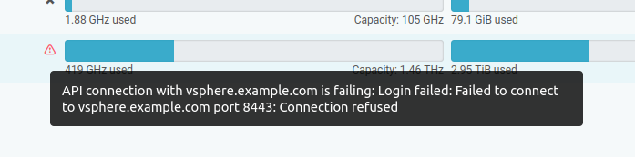

* FEATURE: the daemon can now be restarted from the web UI (#406)
* FEATURE: use alpha channel images for HPE servers, where available (#425)

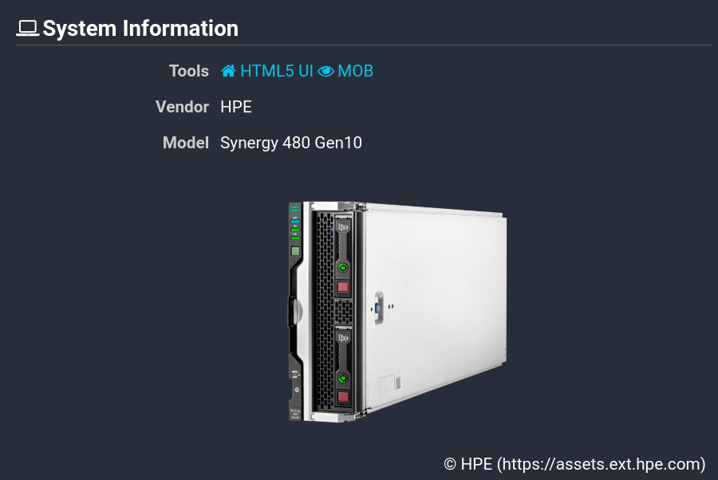

* FEATURE: CPU usage look has been improved (#427)
* FEATURE: overall and power state look better now (#433)

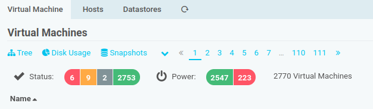

* FEATURE: Virtual Machines table distinguishes Templates (#437)
* FEATURE: German translation for 100% of all translatable strings (#438)

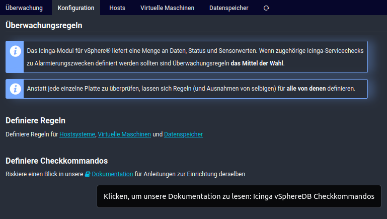

* FEATURE: mobile version UI has been improved (#440)

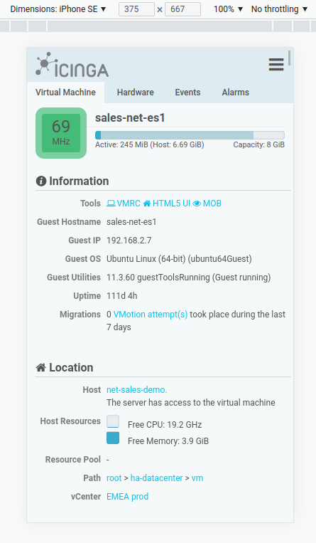

* FEATURE: vendor images can now be cropped (#441)
* FIX: links pointing to the VMware HTML5 UI have now work on v6.7 and v7.x (#209)
* FIX: issues with dark/light mode in Icinga Web have been addressed (#355)
* FIX: Monitoring Rules documentation link was missing (#360)
* FIX: a debugging output leftover has been removed (#364)
* FIX: Monitoring Rules menu entry is now shown to admins only (#366)
* FIX: fixed formatting for values between 1000 and 1024, 1.02E+3 GiB vs 1.00 TiB (#367)
* FIX: guest disk usage percentage value visualisation (#411)
* FIX: image URLs for ProLiant Gen9 servers have been fixed (#426)
* FIX: image URLS for some DELL server have been fixed/improved (#432)

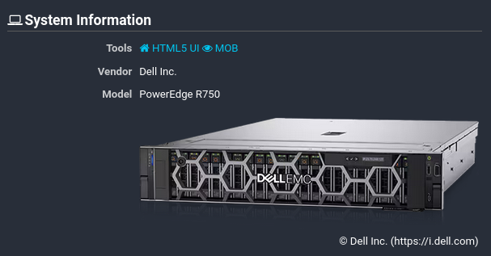

* FIX: search and sorting has been fixed for the vCenter overview (#419)
* FIX: no transparency for dropdown menus (#429)
* FIX: number of recent vMotion attempts has been fixed (#439)
* FIX: Alarm calendar has been using an outdated visualization (#303)
* FIX: arrow and pagination keys no longer trigger the search field (#442)

### Permissions and Restrictions
* FEATURE: it's now possible to restrict access to specific vCenters only (#410)

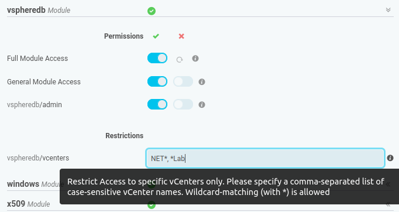

### Monitoring Rules
* FEATURE: the configuration tree now highlights nodes with rules (#369)
* FEATURE: now also Host Systems and Datastores have a Monitoring tab (#395)
* FEATURE: the UI now reflects all Check Command details (#398)

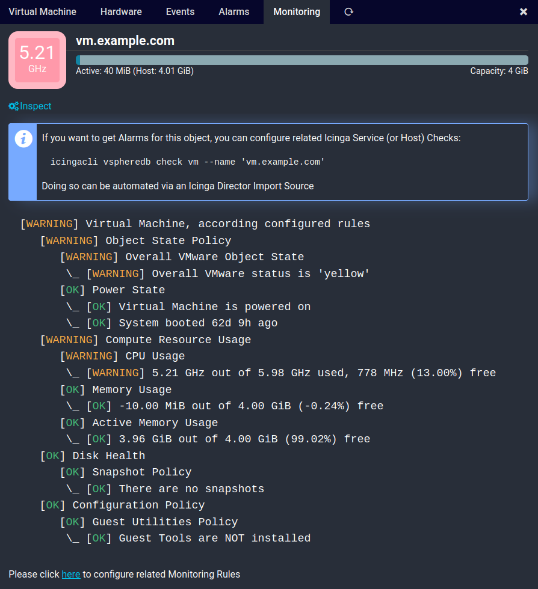

* FEATURE: improved Rule set naming (#402)
* FEATURE: it's now possible to define memory usage rules (#405)
* FEATURE: current state now links to the related configuration page (#420)
* FEATURE: CPU usage based rules have been implemented (#409)

* FEATURE: thresholds for Datastore usage are now available (#423)
* FEATURE: there is now a problem overview for Monitoring Rules (#413)

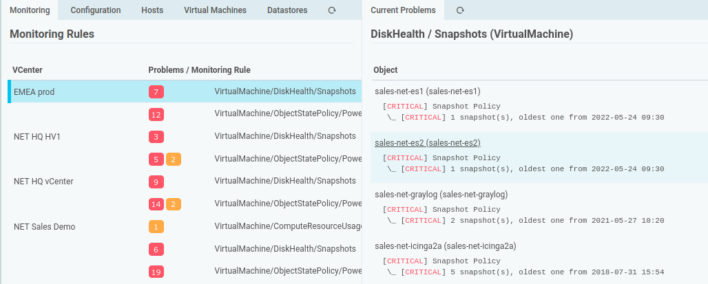

* FIX: Monitoring Rule inheritance had some bugs (#363)
* FIX: Rules for different types on the same folder (DC only) conflicted (#365)

### Check Plugins
* FEATURE: a new vSphereDB daemon health check has been introduced (#245, #400)

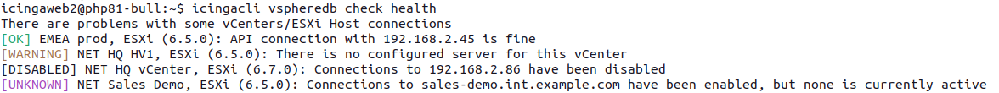

* FEATURE: check for single vCenter connections has been reintroduced (#300, #401)
* FEATURE: Monitoring Rule checks now support Rule Set and Rule filters (#396)
* FEATURE: provide an --inspect parameter for Monitoring Rule checks (#397)

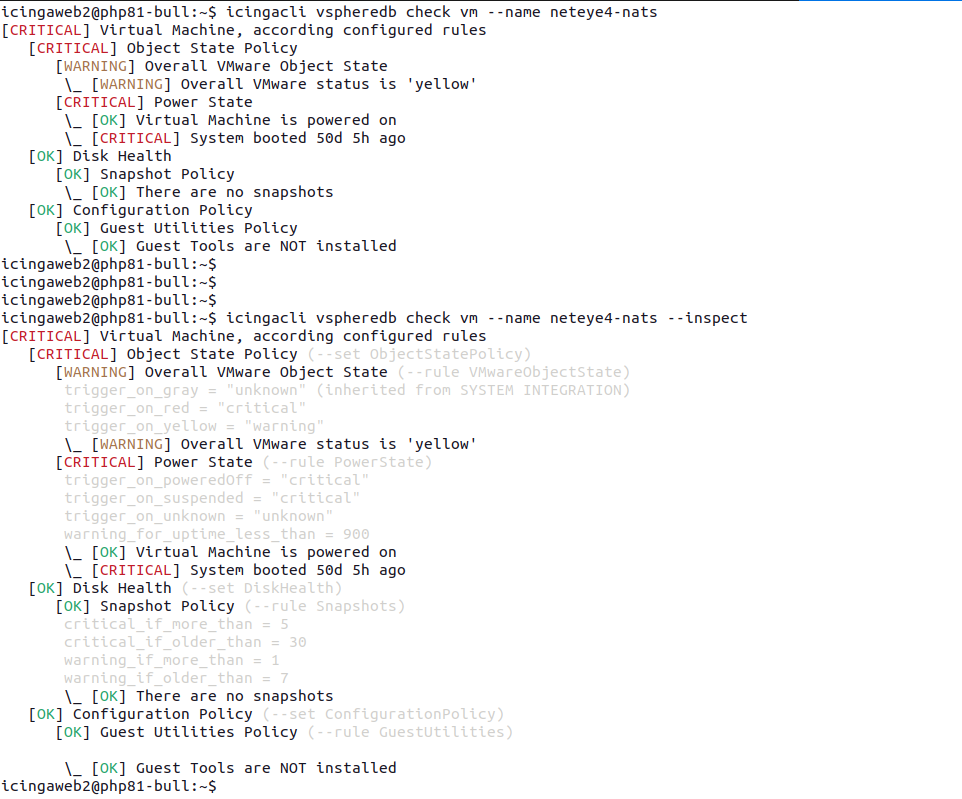

* FEATURE: health check now checks whether the schema is up-to-date (#403)
* FEATURE: daemon keep-alive in the database is being checked (#404)

* FEATURE: single object check commands now support --uuid (#415)

### Background Daemon
* FEATURE: errors on shutdown are now logged (#407)
* FEATURE: object UUIDs are now logged in a human-readable way (#421)
* FEATURE: new caching and preloading mechanisms have been implemented (#422)
* FEATURE: fatal errors are caught when persisting Task results to DB (#435)
* FIX: API connections did not recover from some error states (#399)
* FIX: schema migration should be logged before it takes place (#418)
* FIX: Host Sensor readings now support 64bit values (#428)

### vSphere API
* FEATURE: Host Bus Adapters are now synchronized (#380)

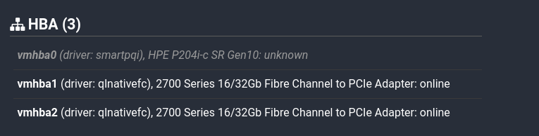

* FIX: fixed compatibility with vSphere 5.5, caused by Custom Fields in v1.4 (#377)

### InfluxDB
* FEATURE: line protocol body is now being sent in compressed mode (#388)
* FEATURE: a special header for debugging purposes is being sent (#431)
* FEATURE: Host Network performance counters are now shipped (#436)
* FIX: connections configured as "autodetect" used to fail silently (#386)
* FIX: v2 API support has been fixed, no more need to configure a v1 user (#387)

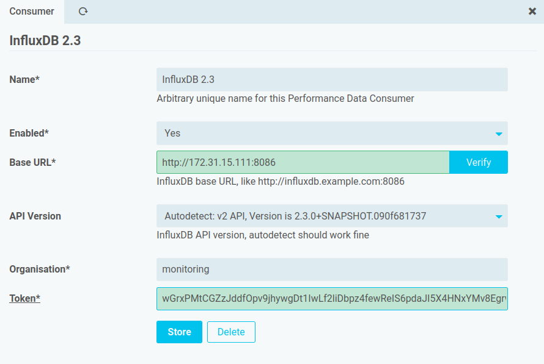

### Integrations
* FEATURE: Director Import Source now ships ManagedObject-references (#383, #384)
* FEATURE: Director Import provides SysInfo/BIOS-UUIDs (#385)
* FEATURE: Director Import ships object UUIDs (#414)
* FEATURE: Director Import allows to ignore powered off VMs and ships power state (#393)
* FEATURE: Director Import ignores templates per default, can be configured (#443)

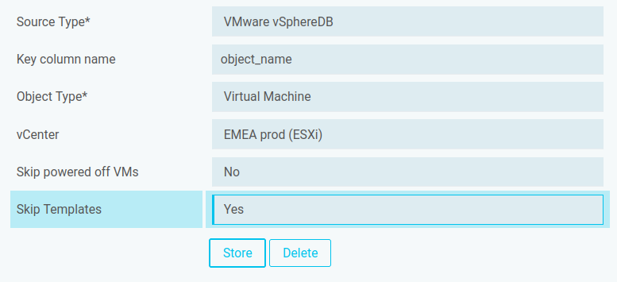

* FIX: Monitoring module integration, when configured with Custom Vars (#381)

### Internals
* FEATURE: SOAP-mapped classes support dynamic properties for PHP 8.2 (#430)
* FEATURE: Guest Disk information is being kept for powered off VMs (#434)
* FEATURE: tags are now fetched (but not used) for Uplink hints (#218)

### Fixed issues
* You can find issues and feature requests related to this release on our
  [roadmap](https://github.com/Icinga/icingaweb2-module-vspheredb/milestone/11?closed=1)

v1.4.0
------

This release addresses one of our most-wanted feature requests. Many of you
asked for advanced Check Plugins and related possibilities. Those requests have
not been unheard, but we had other plans: instead of shipping a lot of Plugins
with a lot of commandline options, we had a rule-based approach in mind.

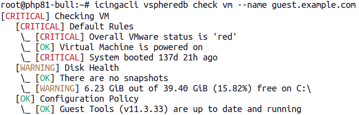

Finally, with v1.4.0 we're shipping such. The Check Command provides many new
granular details, and the Web UI is also able to show them:

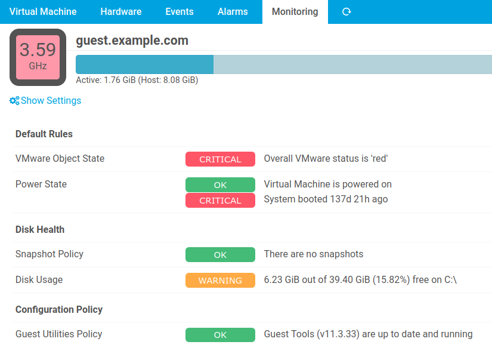

You can continue to use the existing  simplistic Check Commands, but their behavior
is no longer predefined: You're allowed to tweak a lot of settings and thresholds
directly in the Web frontend.

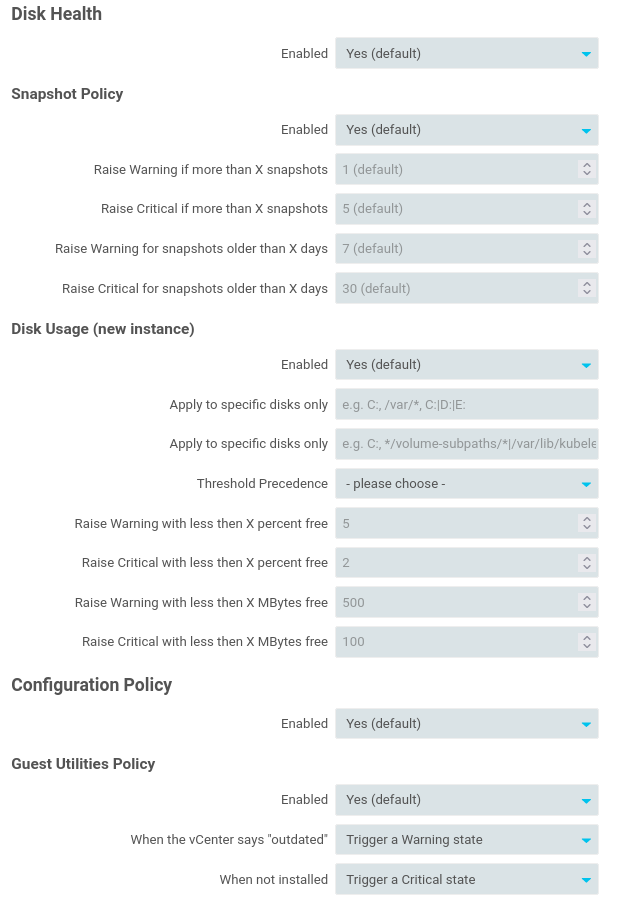

All this at a hierarchical level, so if you organized your Objects in folders,
you can apply different settings to different vCenters, Datacenters, Environments
and so on.

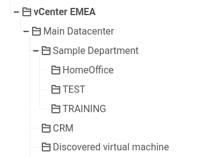

For more related details, please check the related [Documentation Section](31-Check_Commands.md).

Also, this release now integrates with the Icinga Web Monitoring module. In case
a monitored Host maps to a VMware Host or VirtualMachine, related details are now
shown directly in the Monitoring module, linking to vSphereDB.

### Upgrading

Please check our [Upgrade Script](01-Installation.md#modul-installation-or-upgrade).

### Breaking Changes
* This module now requires at least PHP 7.1, please check our [Installation documentation](01-Installation.md)
  for related details

### Background Daemon
* FIX: log "reconnecting to DB" only when doing so (#353)
* FEATURE: log a notice, when main processes DB connection is ready (#354)

### CLI
* FEATURE: Monitoring Rules have been implemented (#357)
* FEATURE: Disk checks are now available (#198)

### Documentation
* FEATURE: check commands are now documented (#221)

### Database Schema
* FIX: addressed an older schema upgrade issue, affecting v1.1.0 (#298)

### Requirements
* BREAKING: PHP 7.1 is now required (#351)
* FEATURE: officially supported DB Server versions have been raised (#352)

### Fixed issues
* You can find issues and feature requests related to this release on our
  [roadmap](https://github.com/Icinga/icingaweb2-module-vspheredb/milestone/9?closed=1)

v1.3.1
------

This is a minor bugfix release. It fixes some cosmetic issues and helps those
who configured vCenter connections through HTTP proxies.

### Upgrading

Please check our [Upgrade Script](01-Installation.md#modul-installation-or-upgrade).
When talking to your vCenters through an HTTP proxy, you should also upgrade the
Incubator module to at least v0.15.0. We consider raising dependencies a breaking
change, that's why we do not enforce this version unless v1.4.0.

### vSphere API
* FEATURE: SOAP client now identifies itself as Icinga-vSphereDB/1.3 (#349)
* FEATURE: HTTP proxy option is now prefixed with its scheme (#350)
* FEATURE: SOAP client now logs response body parts on SOAP fault (#348)
* FIX: we now strip proxy CONNECT headers from responses (#347)

### Fixed issues
* You can find issues and feature requests related to this release on our
  [roadmap](https://github.com/Icinga/icingaweb2-module-vspheredb/milestone/10?closed=1)

v1.3.0
------

This version fixes issues which could have occurred when running for at least
medium-sized vmWare installations while using a DB with relatively high
latencies. We are now handing over data we fetched from your vCenter to a
dedicated subprocess, which then synchronizes batched information to your DB
task per task.

In case a task takes longer than expected, you can now spot it in your process
list. The DB process always shows its current task:

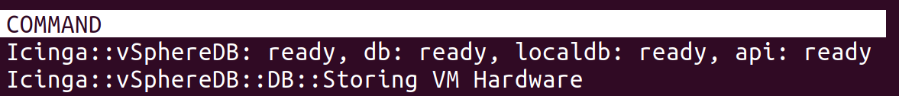

Error Handling has been improved, making the daemon more robust, InfluxDB support
is easier to configure.

vSphereDB strongly suggests using a vmWare user with a global readonly permission,
however with this release it is now also possible to use a user who has been
granted read permissions for only a small subtree of your vCenter.

PHP 8.1 is now supported and can be used as soon as we release a related Icinga
Web 2 version.

### Upgrading

Please check our [Upgrade Script](01-Installation.md#modul-installation-or-upgrade).

### UI
* FIX: deleting an InfluxDB subscription succeeded, but error popped up (#293)
* FIX: got a wrong web UI redirection when running with an outdated DB schema
* FIX: Changing InfluxDB version once configured didn't work (#314)
* FIX: VCenter Summary links to "Templates" page was useless (#315)
* FIX: very long mount point names no longer have an impact on the UI
* FIX: link from "Datacenters" table pointed to a 404 (#319)
* FIX: Unix Socket access forbidden for setups w/o PHP-FPM (#330)
* FIX: NetBackup detail deals with missing annotation properties ( #329)
* FEATURE: small performance tweaks for views filtering for a single parent
* FEATURE: the InfluxDB connection form now validates your credentials (#284)
* FEATURE: an InfluxDB consumer can now be modified, no need for delete/create
* FEATURE: new Host Vendor images have been added (#291)
* FEATURE: setups with access to no Hosts, just VMs are now supported (#306)
* FEATURE: VM/Host/Datastore tabs now preserve (recursive) parent filter (#320)
* FEATURE: preserve and pass (recursive) parent filter to VM disks/snapshots (#321)
* FEATURE: some CSS refinements here and there (#323)
* FEATURE: UI now warns about recently booted VMs and Hosts (#344)

### InfluxDB
* FIX: race condition in our chunked asynchronous writer has been fixed (#318)
* FIX: no longer fetching a full hour of data on startup, reduces memory footprint
* FEATURE: failing InfluxDB requests are now being logged

### DB:
* FIX: last event timestamp lookup was slower than it should have been (#311)
* FIX: we're now retrying, if the initialization fails early (#307, #312)

### vSphere API
* FEATURE: changes to a connection now cause a full logout if connected (#322)

### Background Daemon
* FEATURE: protect ourselves against overly conservative memory restrictions (#313)
* FEATURE: we no longer complain about getting no Hosts, Datastores, and similar (#306)
* FEATURE: former sessions are now logged out when initiating a connection (#339)
* FEATURE: WSDL files from disk cache are now being validated (#340)
* FIX: outdated storage information are refreshed with a 6-hour grace period (#316)
* FIX: errors when fetching WSDL files are now logged, invalid files rejected (#335)
* FIX: a useless error message for those w/o Storage Pods has been removed (#310)
* FIX: DB sub processes now ships debug log to it's parent
* FIX: invalid UTF-8 characters from exceptions are now filtered (#337)
* FIX: login/authentication errors are now being logged (#338)
* FIX: initialization background are stopped correctly on failure (#341)

### Fixed issues
* You can find issues and feature requests related to this release on our
  [roadmap](https://github.com/Icinga/icingaweb2-module-vspheredb/milestone/7?closed=1)

v1.2.1
------

This is a minor bugfix release. A problem with older PHP versions has been fixed.
This affected only End Of Live versions (&lt;7.3), but we still support them.
Depending on your  Curl version, you might have faced problems with vmWare 7.x.
This has also been solved.

To use authentication with InfluxDB v1.x please upgrade the Incubator module to
at least v0.10.1. This is optional, we'll not raise dependencies  with a patch
release. The remaining fixes are mostly there to improve debugging and logging,
and to avoid useless API requests under error conditions.

We usually do not add new features to patch releases, but this release ships a
bunch of new Host Vendor images for HPE, Fujitsu and Dell servers. We're pretty
confident that they'll not cause any problems.

### Upgrading

To benefit from all fixes, please restart the *Background Daemon* after upgrading
the module.

### Background Daemon Tasks
* FIX: login errors are now propagated immediately, causing visible error (#286)
* FIX: refresh outdated VM datastore usage in small chunks (#287)
* FIX: do not refresh outdated VM-related datastore usage on startup (#281)
* FIX: EventCollector instances might fail, we now forget about them (#289)
* FEATURE: DB process stop is now enforced after a short timeout (#290)

### SOAP, vmWARE API
* FIX: avoid some CURL versions to send Expect: 100 continue (#274)
* FIX: log non-SOAP errors, but let SOAP errors go through (#274)

### Scheduling
* FIX: Refreshing outdated VM datastore usage can no longer run in parallel (#288)

### InfluxDB
* FIX: Fix authentication with InfluxDB v1.x (#283)

### Compatibility
* FIX: remove a trailing comma, that broke support for (EOL) PHP versions (#276)

### UI
* FEATURE: new Host Vendor images have been added (#277, #278)

### Fixed issues
* You can find issues and feature requests related to this release on our
  [roadmap](https://github.com/Icinga/icingaweb2-module-vspheredb/milestone/8?closed=1)

v1.2.0
------

With a background daemon rewritten from scratch, this version improves performance,
speed and stability. It no longer requires a dedicated process per vCenter/ESXi
connection.

There have been many improvements to the UI. And last but not least, you can now
optionally ship  performance data / metrics to InfluxDB instances.

### Breaking Changes
* Installation procedure has been changed

### Upgrading

Please restart the Background Daemon after upgrading to v1.2.0. It then launches
its new Control Socket and applies DB Schema migrations on its own.  The daemon
now needs write permissions for a special directory. Once again, our
[Installation](01-Installation.md) documentation should contain everything you
need.

### UI
* FIX: hide column for an experimental feature (#153)
* FIX: avoid PHP warnings on 7.4 when showing Host details/special cols (#169)
* FIX: deleting Server connections has been fixed (#155)
* FIX: Server Form presents masked dummy value, not masked password
* FIX: sorting hosts by state summary
* FIX: do not fail when showing VMs with missing linked hosts (#204)
* FIX: show and link dependencies for web 2.9+ (#258)
* FEATURE: show Virtual Machine Custom Values (#88)
* FEATURE: Hosts Table now provides ESXi version column
* FEATURE: show Host NIC information (#177)
* FEATURE: a console link (via VMRC) is now available (#141)
* FEATURE: reorganized VM detail sections (#182)
* FEATURE: propose DB migrations in a more prominent place (#20)
* FEATURE: detail view has been optimized for wider screens (#186)
* FEATURE: installed VMware tools version is now available (#71)
* FEATURE: overview tree no longer skips some levels (#181)
* FEATURE: support 'compact' mode for dashboard use (#134)
* FEATURE: vCenter summary now shows Storage totals (#191)
* FEATURE: optional VMware software column for the vCenter overview (#192)
* FEATURE: Veritas NetBackup backup tool info now also works with Custom Values (#193)
* FEATURE: VM location details now provide a link to the vCenter (#148)
* FEATURE: HTML5 UI link has been introduced (#194)
* FEATURE: vCenter links point to new vCenter summary/detail page (#195)
* FEATURE: improve sensor table styling (#196)
* FEATURE: restructure/style Host Detail view (#199)
* FEATURE: VM details now show host resource usage (#120)
* FEATURE: Provide suggestions in case there is no vCenter (#189)
* FEATURE: allow to define a custom vCenter display name (#121)
* FEATURE: show VM templates as such to make them distinguishable (#205)
* FEATURE: add vCenter-related object summaries (#237)
* FEATURE: provide a MOB link for every vCenter (#267)
* FEATURE: show Host System images for known vendors and models (#270)

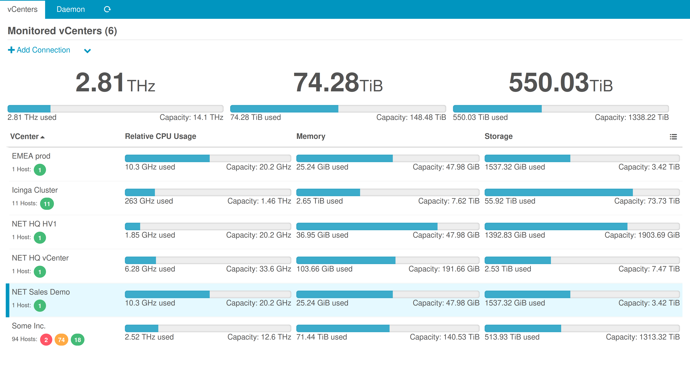

### CLI
* FIX: vm check now also looks for object name (#109)
* FIX: strip non-UTF8-characters from error messages (#124)
* FIX: check command should show critical problems first (#126)

### Background Daemon
* FIX: do not allow ENV proxy settings to override server config (#159)
* FIX: sync no longer fails on objects with no overallState (#98)
* FIX: sub-tasks will now terminate early on DB errors (#151)
* FIX: correct log-level is now passed to child-processes (#138)
* FIX: there was one more issue with zero-sized DataStores (#149)
* FIX: Host PCI devices fixed for Mysql 8.x (#86)
* FIX: do not fail when there are Opaque Networks (#166)
* FIX: eventual DB errors in moref task are now re-thrown (#167)
* FEATURE: synchronize Custom Values (#88)
* FEATURE: synchronize VirtualMachines belonging to vApps (#31)
* FEATURE: synchronize many Host Network related objects (#177)
* FEATURE: log VMs with no parent to learn more about them (#202)
* FEATURE: log entries now show the related server name (#264)
* FEATURE: logging to journald takes place via socket (#271)

### Integrations
* FEATURE: ship more VM properties with our Director Import Source
* FEATURE: ship Custom Values for the Icinga Director (#88)
* FEATURE: Import Source now ships Compute Resources (#185) and Datastores (#246)
* FEATURE: vCenter name is now shipped with all importable object types (#248)
* FEATURE: it's now possible to filter Imports by vCenter (#247)

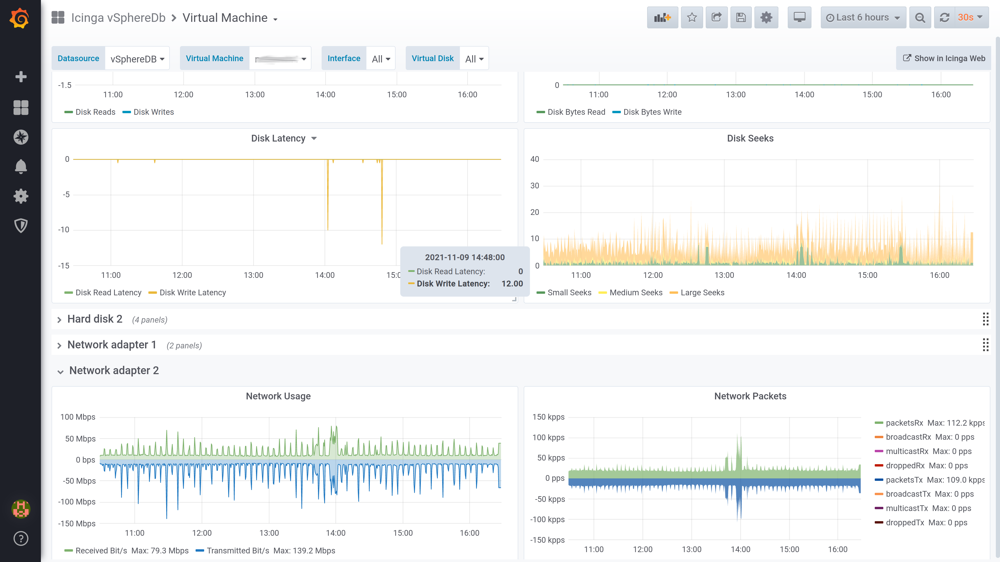

### DB Schema
* FIX: dropped a unique constraint on BIOS UUID because of VMware bugs (#83, #99)
* FIX: large-grown daemon log table has been truncated (#138)
* FIX: allow event/alert messages longer than 64kB (#133)
* FIX: allow unusually large guestFullName values (#146)
* FIX: allow most VM values to be NULL, VMs which never started (#197, others)
* FIX: allow longer moref ids for Opaque Network and DVPGs (#166)
* FEATURE: compute_cluster is now a dedicated table and object (#187)
* FEATURE: introduce host_system DAS/HA-state (#200)

### vSphere API
* FIX: login to vSphere 7.0 failed (#175)
* FIX: tweak invalid sensor status names in 7.0 (#179)
* FEATURE: vSphere/ESXi v7.0 is now officially supported (#188)

### Fixed issues
* You can find issues and feature requests related to this release on our
  [roadmap](https://github.com/Icinga/icingaweb2-module-vspheredb/milestone/6?closed=1)

v1.1.0
------

This release brings bug fixes, stability and some new features. We're now telling
your vCenter to refresh outdated Datastores. We discovered that depending on your
configuration your vCenter might ship VERY old information. With this release we're
smoothly kicking it when necessary. Also, right now this module ships an Import
Source for the Icinga Director.

### Breaking Changes
* This module no longer depends on the Icinga Director
* New dependencies have been introduced, our [Installation](01-Installation.md)
  documentations contain related details

### Upgrading

This release brings Schema migrations, which can be applied with a single click
in the Frontend. Please go to *Virtualization (VMware)* - *Configuration* and
**Apply** the pending schema migration. Afterwards please restart the *Background
Daemon*.

### UI
* FIX: catch more configuration errors in a friendly way (#62)
* FIX: DataStores did not appear in their Tree View in most setups
* FEATURE: show time without date for today's events
* FEATURE: support VmResettingEvent (#58)
* FEATURE: Allow to configure connections to non-default ports
* FEATURE: Event Overview uses a neutral color when not filtering per type

### Schema
* FIX: Service Tags can now be longer than 32 characters (#60)
* FIX: Allow VMs to have no Instance- and no BIOS-UUID

### Background Daemon
* FIX: allow failures when not yet initialized (#59)
* FIX: catch errors related to temp dir creation (#59)
* FIX: accept VMs with no hardware (#59)
* FIX: support Clone-Events, they have been fetched but failed (#48)
* FEATURE: support VmResettingEvent (#58)
* FEATURE: force refresh on outdated Datastores (#57)
* FEATURE: log related task name on errors

### All Issues and Feature Requests
* You can find issues and feature requests related to this release on our
  [roadmap](https://github.com/Icinga/icingaweb2-module-vspheredb/milestone/4?closed=1)

v1.0.4
------

This is a minor bugfix release. Also, it makes sure that this module will work
smoothly with the upcoming Icinga Director v1.7.0 release. It supports/tolerates
more data anomalies like unexpected NULL values. Talking to custom API ports is
now supported.

### Upgrading

Please restart the *Background Daemon* - it's error handling has been improved.

### UI
* FIX: Do not fail  with Director v1.7.0 (#118)
* FIX: Non-admin users should be allowd to customize columns (#92)
* FIX: Do not offer migration wizard in case of connection issues (#62)

### Background Daemon
* FIX: Keep retrying on initialization errors (#44)
* FIX: Do not fail for VMs with "no hardware" (#59)
* FIX: Do not warn when disconnecting in disconnected state (#59)
* FIX: Fail nicely on permission issues (#59)
* FIX: Support zero-sized DataStores (#75)
* FIX: Improve error handling for unknown classes (#48)
* FIX: Eventually force refresh for storage.perDatastoreUsage (#57)
* FIX:  ChooseDbResourceForm: fail friendly even when misconfigured (#51)

### Schema
* FIX: Support Service Tags longer than 32 characters (#60)
* FIX: Support the VmResetting Event (#58)

### All Issues and Feature Requests
* You can find issues and feature requests related to this release on our
  [roadmap](https://github.com/Icinga/icingaweb2-module-vspheredb/milestone/5?closed=1)

v1.0.3
------

This is a minor bugfix release. It improves error handling, shows Guest Disk
usage bar column per default and highlights Active Host Memory even when higher
than available VM Memory. Host System details view has been re-organized:

### Upgrading

Please restart the *Background Daemon* - it's error handling has been improved.

### UI
* FIX: Memory Usage shows Host Memory usage when exceeding available memory (#18)
* FEATURE: VM Guest Disk Usage now shows usage bar per default (#46)
* FEATURE: Host Information has been re-organized (#47)

### Background Daemon
* FIX: Keep retrying on initialization errors (#44)
* FIX: Avoid useless attempt to kill dead children (#45)

### All Issues and Feature Requests
* You can find issues and feature requests related to this release on our
  [roadmap](https://github.com/Icinga/icingaweb2-module-vspheredb/milestone/3?closed=1)

v1.0.2
------

This is a minor bugfix release. Improves documentation and error handling, deals
with standBy Hosts and extra long BIOS versions. Virtual Machine table now has
one more optional column showing Guest Tools State:

### Upgrading

This release brings a Schema migration, which can be applied with a single click
in the Frontend. Please go to *Virtualization (VMware)* - *Configuration* and
**Apply** the pending schema migration. Restarting the *Background Daemon* is not
required for the migration, but strongly suggested - it's error handling has been
improved.

### UI
* FIX: Do not fail when left with vCenters without vCenter Server (#26)
* FIX: Show less options instead of errors to non-admin users (#30)
* FIX: Redirect after deleting a vCenter Server showed an error (#36)
* FEATURE: Provide a column showing Guest Tools Status (#17, #25)

### CLI
* FIX: `CTRL-C` should not show an error before shutting down the daemon (#34)

### Background Daemon
* FIX: Allow to store Hosts being in `standBy` (#19)
* FIX: Do not fail when a VM reports no attached DataStore (#23)
* FIX: Safely roll back transactions after *any* kind of Exception (#24)

### Schema
* FIX: Support BIOS versions longer than 32 characters (#35)

### Documentation
* FIX: Mention `php-pcntl` dependency (#21)
* FIX: Explain required Username/Permissions (#23)

### All Issues and Feature Requests
* You can find issues and feature requests related to this release on our
  [roadmap](https://github.com/Icinga/icingaweb2-module-vspheredb/milestone/2?closed=1)

v1.0.1
------

This is a minor bugfix release. Fixes two rare error conditions, improves
overall error handling (makes it more robust) and comes with a nice new feature
showing even more details in the Process status:

The Service Unit also shows error conditions:

* FIX: Host System details failed on some hardware models (#16)
* FIX: Catch invalid (-1) host memory usage, found on a weird 6.5 ESXi (#14)
* FIX: Roll back transactions regardless of Exception type, not only after DB
  errors (discovered while debugging #14)
* FIX: do not loose connection to subprocess when an Exception with invalid
  (binary) characters is logged (related to #14)
* FEATURE: show active subprocess tasks in the processlist

v1.0.0
------
First public release.
